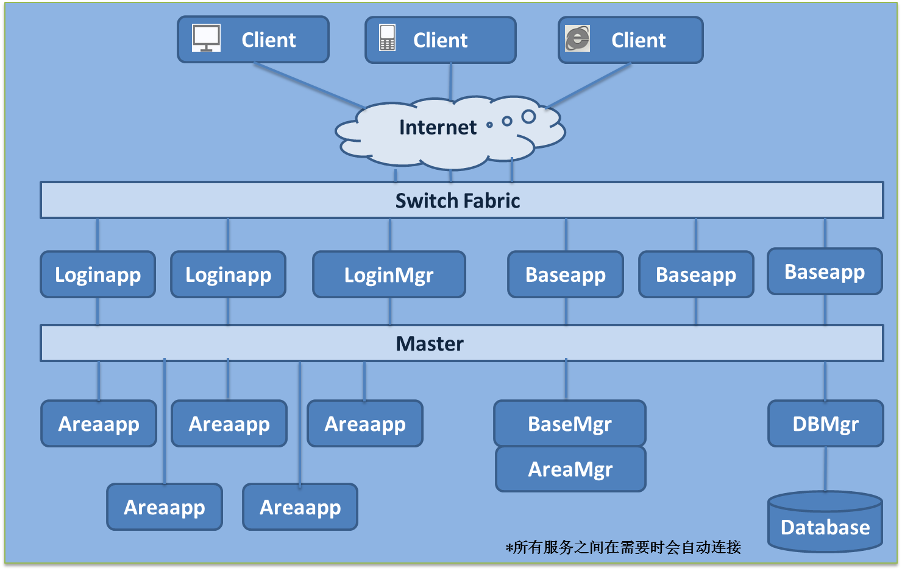

##flynet

  flynet是一个游戏服务器

##framework

##Requirements

- Go 1.5.2 +
- Mongodb or Mysql
- github.com/golang/progobuf
- github.com/bitly/go-simplejson
- github.com/bmizerany/assert
- github.com/go-sql-driver/mysql
- github.com/gorilla/mux
- github.com/gorilla/sessions
- github.com/jimmykuu/wtforms
- github.com/mysll/go-uuid
- github.com/mysll/log4go
- gopkg.in/mgo.v2

##Install

	go get github.com/mysll/flynet
	cd flynet/server/src
	./createdata.sh //转换数据，生成数据类
	./build.sh
	./sync.sh //同步数据库

	运行 flynet/bin/master

##Status

  持续开发中。

About
---------------------------------
  Written by [liangliang.shi](mailto:liangliang.shi@gmail.com) 